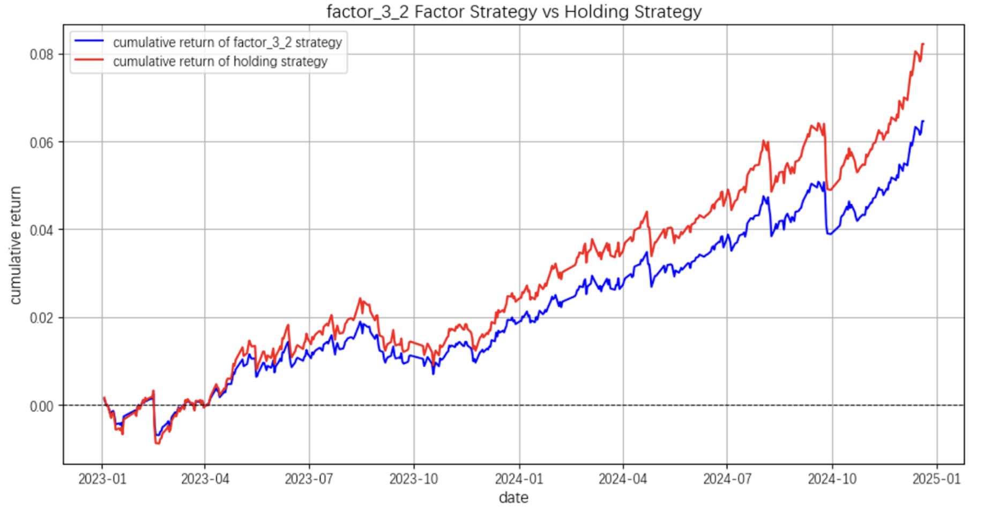

# Factor Mining for Treasury Bond Futures

This project applies genetic programming and symbolic regression to discover predictive, interpretable factors for the next-day return of Chinese 10-year Treasury bond futures. 

## 📌 Summary

- **Data**: Wind database (2018–2024), minute-level and daily-level resampled
- **Features**: 18 price/volume/statistical daily features
- **Method**: Symbolic regression via `gplearn` using rolling 3-year windows
- **Evaluation**: Out-of-sample backtesting with Sharpe, drawdown, and cumulative return

## 🛠️ Tools

- Python, Pandas, NumPy, Matplotlib, ta-lib, gplearn
- [ta-lib](https://pypi.org/project/TA-Lib/) for technical indicators
- [gplearn](https://gplearn.readthedocs.io/en/stable/) for symbolic regression

## 📈 Results

Symbolic factors produced smoother return curves and better drawdown control than buy-and-hold baseline.

 
